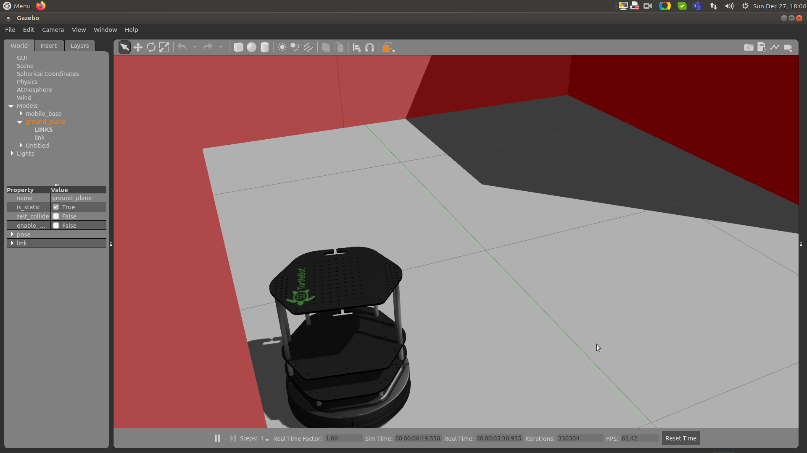
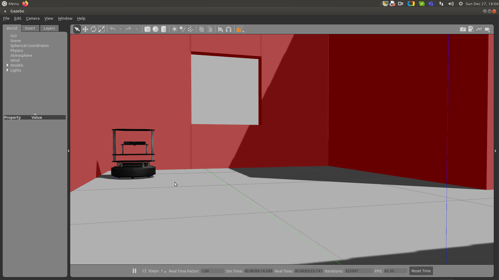
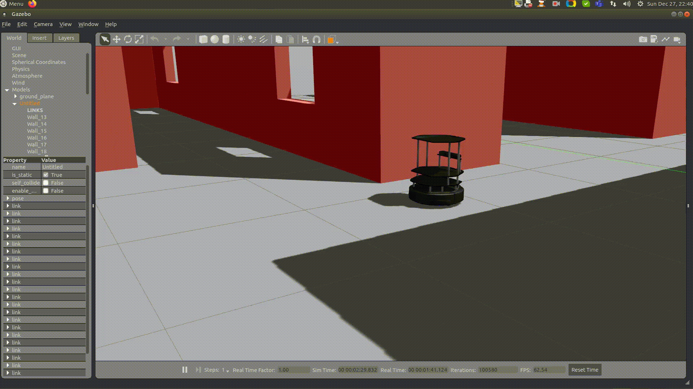
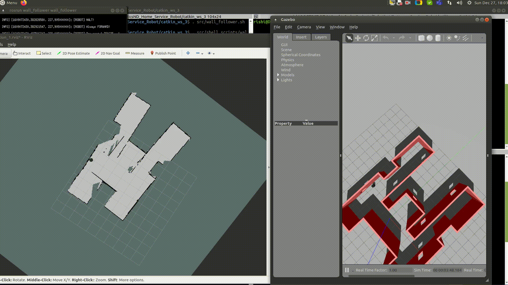

# Home Service Robot

[//]: # (Image References)

[map]: ./images/umap.png "Map of U World"
[t1gaz]: ./images/t1gz.png "At Pickup Location Gazebo"
[t2gaz]: ./images/t2gz.png "At Drop Off Location Gazebo"
[st]: ./images/st.png "Start RViz"
[t1p1]: ./images/t1p1.png "At Pickup Location Before Picking up RViz"
[t1p2]: ./images/t1p2.png "At Pickup Location After Picking up RViz"
[t1d]: ./images/t1d.png "At Drop off Location RViz"

## References
This project utilizes the following ROS packages, cloned all of them on July 14, 2018.

[gmapping](http://wiki.ros.org/gmapping)
[turtlebot_teleop](http://wiki.ros.org/turtlebot_teleop)
[turtlebot_rviz_launchers](http://wiki.ros.org/turtlebot_rviz_launchers)
[turtlebot_gazebo](http://wiki.ros.org/turtlebot_gazebo)


## Package Tree
```
    ├──                                # Official ROS packages
    |
    ├── slam_gmapping                  # gmapping_demo.launch file
    │   ├── gmapping
    │   ├── ...
    ├── turtlebot                      # keyboard_teleop.launch file
    │   ├── turtlebot_teleop
    │   ├── ...
    ├── turtlebot_interactions         # view_navigation.launch file
    │   ├── turtlebot_rviz_launchers
    │   ├── ...
    ├── turtlebot_simulator            # turtlebot_world.launch file
    │   ├── turtlebot_gazebo
    │   ├── ...
    ├──                                # Your packages and direcotries
    |
    ├── World                          # world files
    │   ├── ...
    ├── ShellScripts                   # shell scripts files
    │   ├── ...
    ├──RvizConfig                      # rviz configuration files
    │   ├── ...
    ├──wall_follower                   # wall_follower C++ node
    │   ├── src/wall_follower.cpp
    │   ├── ...
    ├──pick_objects                    # pick_objects C++ node
    │   ├── src/pick_objects.cpp
    │   ├── ...
    ├──add_markers                     # add_marker C++ node
    │   ├── src/add_markers.cpp
    │   ├── ...
    └──
```
## Launch file
```
$ sudo apt-get install xterm
```

Create launch.sh file with the following content
```
#!/bin/sh
xterm  -e  " gazebo " &
sleep 5
xterm  -e  " source /opt/ros/kinetic/setup.bash; roscore" &
sleep 5
xterm  -e  " rosrun rviz rviz"
```
Needs to have run permissions.
```
$ chmod +x ~/catkin_ws/src/launch.sh
```
Run launch.sh to test Gazebo and RViz are working.
```
$ ~/catkin_ws/src/launch.sh
```

## Install Packages
```
$ mkdir -p ~/catkin_ws/src
$ cd ~/catkin_ws/src
$ catkin_init_workspace
$ cd ..
$ catkin_make
$ sudo apt-get update
$ cd ~/catkin_ws/src
$ git clone https://github.com/ros-perception/slam_gmapping
$ git clone https://github.com/turtlebot/turtlebot
$ git clone https://github.com/turtlebot/turtlebot_interactions
$ git clone https://github.com/turtlebot/turtlebot_simulator
$ cd ~/catkin_ws/
$ source devel/setup.bash
$ rosdep -i install gmapping
#All required rosdeps installed successfully
$ rosdep -i install turtlebot_teleop
#All required rosdeps installed successfully
$ rosdep -i install turtlebot_rviz_launchers
#All required rosdeps installed successfully
$ rosdep -i install turtlebot_gazebo
#All required rosdeps installed successfully
$ catkin_make
$ source devel/setup.bash
```

## Testing SLAM
Sending parameter with roslaunch may cause error.
```
$ roslaunch turtlebot_gazebo turtlebot_world.launch world_file:=~/catkin_ws/src/worlds/u.world
```
Caused following error
```
terminate called after throwing an instance of 'boost::exception_detail::clone_impl<boost::exception_detail::error_info_injector<boost::lock_error> >'
  what():  boost: mutex lock failed in pthread_mutex_lock: Invalid argument
Aborted (core dumped)
```

Therefore, the turtlebot_world.launch file was altered to accept u.world as the default world file.

test_slam.sh file content:
```
#!/bin/sh
#xterm  -e  " roslaunch turtlebot_gazebo turtlebot_world.launch world_file:=~/catkin_ws/src/worlds/u.world " &
xterm  -e  " roslaunch turtlebot_gazebo turtlebot_world.launch " &
sleep 3
xterm  -e  " roslaunch turtlebot_gazebo gmapping_demo.launch " &
sleep 3
xterm  -e  " roslaunch turtlebot_rviz_launchers view_navigation.launch " &
sleep 3
xterm  -e  " roslaunch turtlebot_teleop keyboard_teleop.launch "
```
Needs to have run permissions.
```
$ chmod +x ~/catkin_ws/src/test_slam.sh
```
Run test_slam.sh to test slam is working, it requires manual movement of the robot.
```
$ ~/catkin_ws/src/test_slam.sh
```

## Wall Follower
Needs to have run permissions.
```
$ chmod +x ~/catkin_ws/src/wall_follower.sh
```
Run wall_follower.sh to autonomously navigate and create map.
```
$ ~/catkin_ws/src/wall_follower.sh
```
## Test Navigation
Sending map_file parameter caused file not found error. Therefore, amcl_demo.launch file changed to accept uamp.yaml file as the default map.
```
$ roslaunch turtlebot_gazebo amcl_demo.launch map_file:=~/catkin_ws/src/worlds/umap.yaml
```

Needs to have run permissions.
```
$ chmod +x ~/catkin_ws/src/test_navigation.sh
```

Run test_navigation.sh to test navigation is working.
```
$ ~/catkin_ws/src/test_navigation.sh
```

## Pick Objects
Needs to have run permissions.
```
$ chmod +x src/pick_objects.sh
```
Run pick_objects.sh to run two step navigation.

```
$ ~/catkin_ws/src/pick_objects.sh
```

## Add Markers
Needs to have run permissions.
```
$ chmod +x src/add_markers.sh
```
Run add_markers.sh to add and remove a marker on the pick up and drop off locations.

```
$ ~/catkin_ws/src/add_markers.sh
```
Note: The last version works but not as the Project part 11 Modeling Virtual Objects, since the logic has changed, the robot is required to reach to the marker to continue. 

## Home Service
Needs to have run permissions.
```
$ chmod +x src/home_service.sh
```

Run home_service.sh to pick and drop marker to specified locations.
```
$ ~/catkin_ws/src/home_service.sh
```
## Turtlebot







## Results  
### Map  



### Start  


### Pickup  

At Pickup Location Before Picking up RViz  

  
 

At Pickup Location Gazebo  


### Drop off  

At Drop off Location RViz  

  

### Usecase

  

